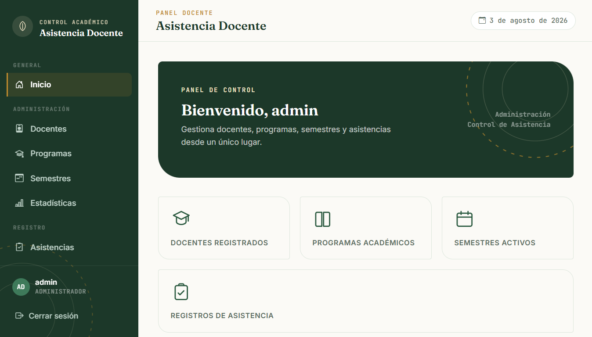
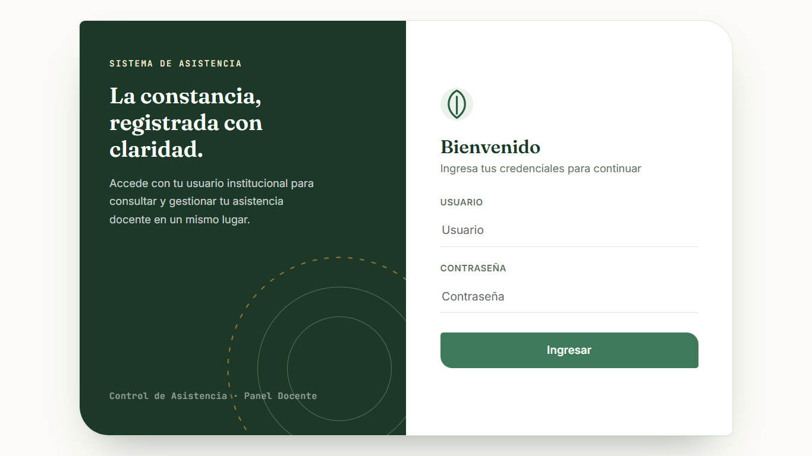
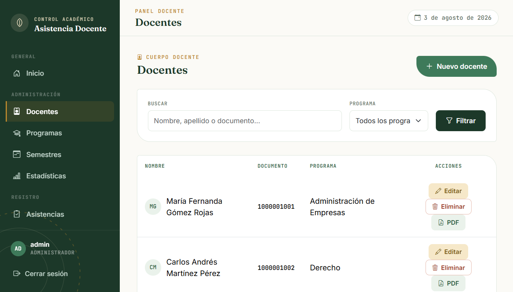
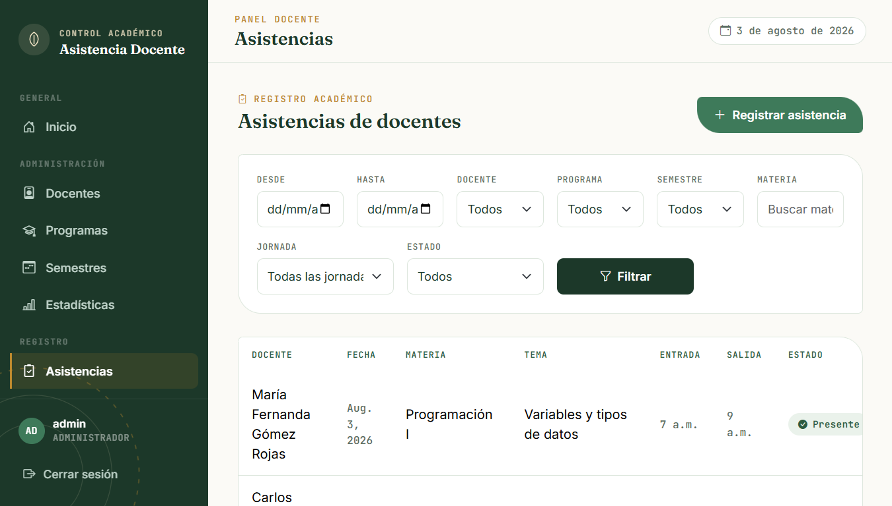
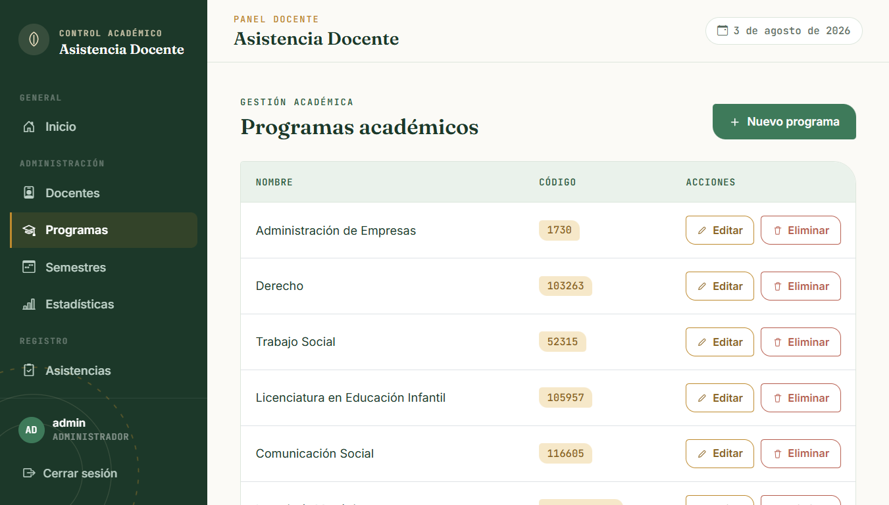
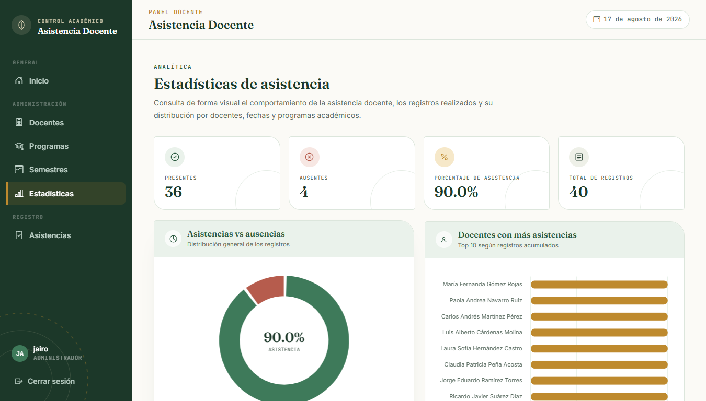

# Sistema de Gestión de Asistencia Docente

Aplicación web desarrollada con **Python y Django** para gestionar el control de asistencia de docentes dentro de una institución educativa. El sistema permite administrar docentes, programas académicos, semestres y registros de asistencia, además de consultar porcentajes de asistencia y generar reportes.

> **Actualización reciente:** se realizó un **rediseño completo de la interfaz (frontend)**, implementando una experiencia visual moderna, responsive y orientada a una mejor experiencia de usuario.

---

# Vista general



**Panel principal del sistema con el nuevo diseño visual.**

---

# Características principales

* Autenticación de usuarios.
* Gestión de docentes.
* Registro de asistencia.
* Consulta de porcentajes de asistencia.
* Administración de programas académicos.
* Administración de semestres.
* Dashboard administrativo.
* Interfaz responsive con diseño renovado.

---

# Tecnologías utilizadas

* **Python 3**
* **Django**
* **SQLite3**
* **HTML5**
* **CSS3**
* **Bootstrap 5**
* **JavaScript**

---

# Capturas del sistema

## Inicio de sesión



Interfaz de autenticación con un diseño moderno y centrado en la facilidad de acceso para administradores y docentes.

---

## Dashboard principal


Panel principal con acceso rápido a las funcionalidades del sistema y una organización visual optimizada.

---

## Gestión de docentes



Módulo para registrar, editar y consultar la información de los docentes.

---

## Registro de asistencia



Formulario para registrar la asistencia de los docentes, incluyendo asignatura, horario, jornada y observaciones.

---

## Programas académicos



Administración de programas académicos y su organización dentro del sistema.

---

## Estadísticas y reportes



Visualización de porcentajes de asistencia y herramientas para el seguimiento de registros.

---

# Mi aporte en el proyecto

Durante esta actualización realicé un **rediseño completo del frontend**, enfocado en mejorar la presentación visual y la experiencia de usuario.

## Mejoras implementadas

* Reestructuración completa de la interfaz.
* Diseño moderno y responsive.
* Mejor organización de formularios y tablas.
* Optimización de la navegación entre módulos.
* Mejora de la jerarquía visual del dashboard.
* Consistencia en colores, tipografía y componentes.

El objetivo fue transformar una interfaz funcional pero básica en una aplicación con una apariencia más profesional y preparada para un entorno real.

---

# Inicio rápido

Clona el proyecto y ejecútalo con los siguientes comandos:

```bash
git clone https://github.com/JairoVaron/asistencia_docente_.git
cd asistencia_docente_

pip install -r requirements.txt
python manage.py migrate
python manage.py createsuperuser
python manage.py runserver
```

Abrir en el navegador:

```text
http://127.0.0.1:8000/
```

---

# Instalación paso a paso

## 1. Clonar el repositorio

```bash
git clone https://github.com/JairoVaron/asistencia_docente_.git
cd asistencia_docente_
```

## 2. Crear un entorno virtual (opcional, recomendado)

**Windows**

```bash
python -m venv venv
venv\\Scripts\\activate
```

**Linux / macOS**

```bash
python3 -m venv venv
source venv/bin/activate
```

## 3. Instalar dependencias

```bash
pip install -r requirements.txt
```

## 4. Aplicar migraciones

```bash
python manage.py migrate
```

## 5. Crear un superusuario

```bash
python manage.py createsuperuser
```

## 6. Ejecutar el servidor

```bash
python manage.py runserver
```

---

# Arquitectura del proyecto

```text
Usuario
   │
   ▼
Frontend (HTML, CSS, Bootstrap, JavaScript)
   │
   ▼
Django Views
   │
   ▼
Django Models
   │
   ▼
SQLite3
```

---

# Estructura del proyecto

```text
asistencia_docente/
│── manage.py
│── requirements.txt
│── README.md
│
├── asistencia_docente/
│   ├── settings.py
│   ├── urls.py
│   └── wsgi.py
│
├── control_asistencia/
│   ├── models.py
│   ├── views.py
│   ├── forms.py
│   ├── urls.py
│   ├── templates/
│   └── static/
│
└── docs/
    └── images/
```

---

# Funcionalidades

## Gestión de docentes

* Registrar nuevos docentes.
* Editar información.
* Consultar el listado de docentes.

## Control de asistencia

* Registrar hora de entrada y salida.
* Asociar asignatura, tema y jornada.
* Consultar registros por fecha y docente.

## Administración académica

* Gestionar programas académicos.
* Gestionar semestres.
* Organizar la información institucional.

## Estadísticas

* Consultar porcentajes de asistencia.
* Visualizar información consolidada.
* Facilitar el seguimiento administrativo.

---

# Problema que resuelve

El sistema reemplaza el registro manual en papel por una plataforma digital que permite:

* Centralizar la información.
* Consultar registros rápidamente.
* Generar reportes.
* Mejorar la seguridad de los datos.
* Optimizar la gestión académica y administrativa.

---

# Autor

**Jairo Varón y Jhon Escorcia**

GitHub: https://github.com/JairoVaron

---

# Licencia

Este proyecto puede utilizarse con fines **educativos y académicos**.
